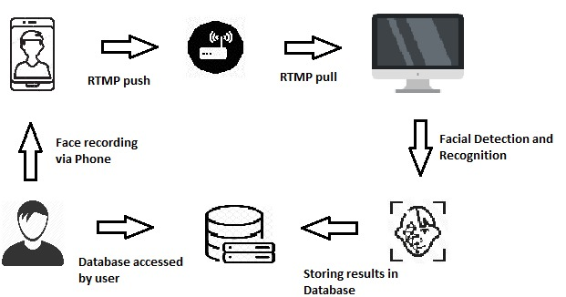

# Class-attendance-System-using-face-recognition
# Product Functions
  ●	Records Attendance autonomously using face detection and facial feature extraction and matching. 
  ●	After Attendance it sends a message to each student about their status of attendance. 
  ●	There would also be a website where the user can login and see his/her attendance and which would also suggest him the minimum number   of classes needed to be attended to maintain the attendance 
 
 
# Product Plan
 
